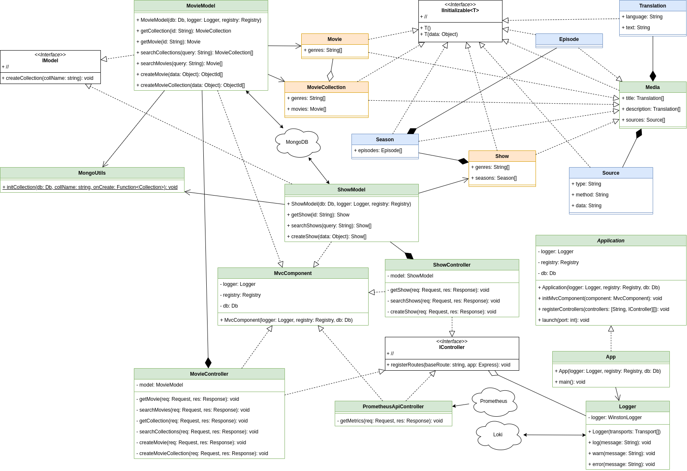
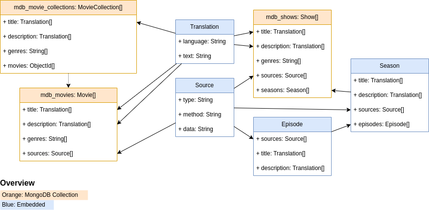
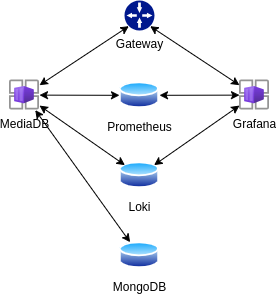

# MediaDB

MediaDB is a RestAPI that serves metadata for media such as movies,
shows and books.

## Technologies

The API itself is a basic TypeScript application that uses
**ExpressJS** to serve the data.

The data is hosted on a **MongoDB** instance, while logs and metrics
are sent to a **Loki** and a **Prometheus** instance.

## Setup

### Requirements

To setup the application, the CLI tool Make is required. All the
commands go through that and the specifications in the Makefile.

Additionally, in the case of docker-compose, the respective
installation has to be done in advance. Then, anything other than
docker will require adjustments to the Makefile.

> **Note:** Adjust the fields `DOCKER` and `DCOMPOSE` to make use
> of the alternative system.

### Docker-Compose

The repository has a `compose.yaml` file that contains the
configuration for docker-compose.

Note that it has some marked lines that should be removed or edited
in a production environment.

Other than that, simply run `make run` to launch the
containers.

That's it. The API should now be available under
`http://localhost:3005` and the Grafana UI should be accessible
from `http://localhost:3004`.

> **Note:** The data sources for Grafana have to be configured
> manually. For that, use the URLs `http://prometheus:9090` and
> `http://loki:3100`.

### Kubernetes

In order to run the application on Kubernetes, a running Kubernetes
cluster and the CLI tool Kubectl is required.

The file `deployment.yaml` serves as a manifest for Kubernetes and
has all the settings and configurations required for running the
application.

The configuration can be applied with
`make kube-apply`.

## API Structure

This image shows the general structure of the application with its
classes:

> **Note:** The database structure is not yet implemented like this.
> This is, however, the aim of this project.

## Database Structure

The following illustration shows the data structures from within the
MongoDB database:

> **Note:** The database structure is not yet implemented like this.
> This is, however, the aim of this project.

## System Design

